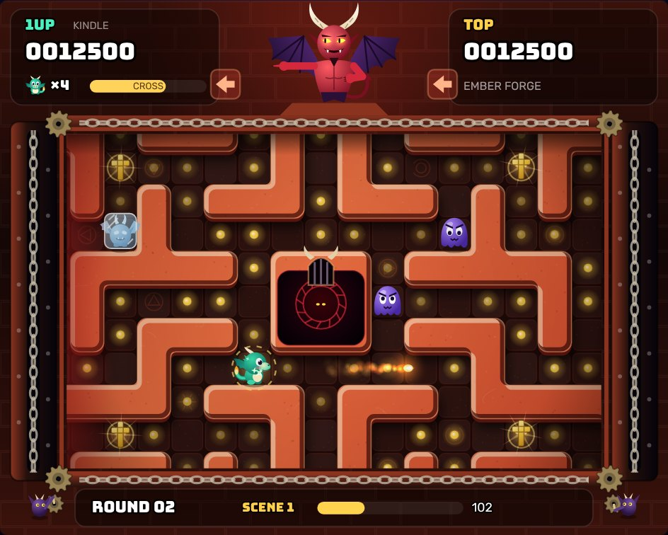

# Devil's Maze

**An unofficial, non-commercial browser remake of _Devil World_ (Nintendo, 1984)**: the same scrolling-maze gameplay with new procedural graphics and sound, browser save slots, and save export/import.



## Credit to the original game

_Devil World_ © 1984 Nintendo.

- Released for the Family Computer (Famicom) in Japan on 5 October 1984, and for the NES in Europe on 15 July 1987.
- Developed by **Nintendo R&D1** and **Intelligent Systems**, published by **Nintendo**.
- Directed by **Shigeru Miyamoto**; designed by **Shigeru Miyamoto** and **Takashi Tezuka**.
- Music by **Koji Kondo** and **Akito Nakatsuka**.

The game design is theirs: the Devil who points while his minions crank the maze, the frame that crushes you against walls, crosses that let you eat dots and breathe fire, the Bibles you carry to the seals, and the bonus round where floor arrows steer the maze.

This project is a fan tribute and is not affiliated with or endorsed by Nintendo. It contains **no code, graphics, music, sound or level data from the original game**. The characters (Kindle and Cinder the dragons, the Gloomlet, Gargling and Furylet enemies, this Devil and his imps), the maze layouts, all artwork and all music are new and generated procedurally in the browser. "Devil World" and "Nintendo" are trademarks of Nintendo and are used here only to credit the original work. Please don't add ROM files to this repository; `.gitignore` blocks them.

Sources for the original credits and rules: [Wikipedia: Devil World](https://en.wikipedia.org/wiki/Devil_World) and the [NinDB Devil World guide](https://nindb.net/guides/old/devil-world/index.html).

## Play

The game is plain HTML/CSS/JavaScript with no build step and no dependencies.

- **Quickest:** open `index.html` in a modern browser (Chrome, Edge, Firefox or Safari). It also works straight from disk (`file://`).
- **Local server:** run `python3 -m http.server` in this folder and visit <http://localhost:8000>.
- **Online:** any static host works, for example GitHub Pages (repository Settings → Pages → deploy from a branch).

The only network request is for the Google Fonts _Bungee_ and _Rubik_. Offline, the game falls back to system fonts.

### Controls

|              | 1 player                               | 2 players (same keyboard)                                    |
| ------------ | -------------------------------------- | ------------------------------------------------------------ |
| Move         | Arrow keys or WASD                     | P1: WASD · P2: arrow keys                                    |
| Breathe fire | Space, Z, X, Enter, F, J, K, L…        | P1: Space, F, G, Z, X · P2: Enter, Right Shift, Right Ctrl, `/`, `.`, L |
| Pause / menu | Esc or P                               | Esc or P                                                     |

- **Gamepads:** d-pad or left stick to move, any face button to fire, Start to pause. In 2-player mode a single gamepad controls player 2, so one player can use the keyboard and the other a pad.
- **Touch screens:** an on-screen pad and FIRE button appear automatically. You can force them on or off in Options.
- **Menus:** mouse, touch, keyboard (arrows, Enter, Esc) or gamepad (d-pad, A, B).

### How to play

Each round has three scenes, as in the original:

1. **Magic dots.** Walk over a **cross** to pick it up. You can only eat dots and breathe fire while holding a cross. It runs out after a while (the meter flashes first), and the marker refills later. Clear every dot. Burnt slimes leave a toasted puff (500 points). Four candy apples (800 points) appear once half the dots are gone.
2. **Devil gates.** Pick up a **Bible** (1000) and carry it to one of the four red gates around the Devil's nest (+1000). While you carry a Bible you can breathe fire. Seal all four gates.
3. **Bonus.** The Devil naps for 40 seconds and there are no enemies. Step on the **arrow tiles** to choose which way the maze slides, and open the six chests. One chest holds a dragon egg, worth an extra life. Being crushed here only ends the bonus.

The Devil above the maze points in a direction, and his imps crank the maze that way. The maze wraps around at every edge, but the frame around the view is solid. **If the frame pushes you into a wall, you are crushed.** A red glow and the arrow badges show which edge is closing in.

Enemies: the **Gloomlet** (violet slime) can be burnt. The **Gargling** (stone imp, from round 2) is only frozen by fire for a moment. The **Furylet** (red slime, from round 7) is faster than you. Difficulty rises over rounds 1–16 and stays at the round-16 level after that.

## Saving, export and import

- Pause (**Esc**) → **Save Game** writes the whole game to one of **three browser slots**: maze, remaining dots, enemies, timers, scroll position and random seed. Loading resumes exactly where you were, even mid-scene. Each slot shows a thumbnail, the round and scene, scores, lives and the save time.
- **Export** downloads a slot as a `.json` file, for example `devils-maze_slot1_round03-scene2_2026-10-06.json`. **Export current game…** downloads the running game without using a slot.
- **Import save file…** reads a `.json` file back. You can put it into any slot or play it straight away.
- Slots are stored in the browser's `localStorage` for this site only. Clearing site data deletes them, so export anything you want to keep. If storage is unavailable (some private modes), the slot list says so and export/import still work.
- Save files are versioned and carry a checksum. Every value is re-validated on load, so a damaged or hand-edited file is refused with a message instead of breaking the game.

## Technical notes

- **Refresh-rate independent.** The simulation always runs at a fixed 60 ticks per second. Real time is accumulated in whole microseconds (integer maths, so no rounding drift) and the loop runs `floor(elapsed × 60)` ticks. Rendering interpolates between the last two ticks, so a 30, 60, 120, 144 or 240 Hz display plays at the same speed and stays smooth. Positions use whole sub-pixel units (one cell = 256 units). Particles follow closed-form curves evaluated at render time.
- **Procedural graphics.** Characters and items are drawn from canvas paths and gradients. Maze walls are traced into outlines, rounded, embossed and textured once per scene, then cached. There are no image files.
- **Procedural audio.** Sound effects are synthesised with WebAudio oscillators and filtered noise. The music is a small step sequencer playing original tunes and is scheduled on the audio clock.
- **Deterministic.** The same seed and inputs always produce the same game, which is what makes exact save/restore possible.

### Project layout

```
index.html          page, menus and screens
css/style.css       layout and menu styling
js/util.js          maths helpers, seeded RNG, checksum
js/config.js        constants and per-round difficulty
js/mazes.js         the original maze layouts for this remake
js/game.js          rules and simulation (plain-data, saveable state)
js/art.js           procedural characters and items
js/render.js        maze/frame layers, sprites, HUD
js/fx.js            particles, pop-ups, shake, flashes
js/audio.js         synthesised sound effects and music
js/input.js         keyboard, gamepads, touch
js/save.js          slots, export, import, settings
js/loop.js          fixed-timestep loop
js/ui.js, main.js   menus and app controller
tests/              headless tests and an automated playthrough
```

### Tests

Requires Node.js 18 or newer. No packages to install.

```
node tests/run-tests.js            # rules, mazes, determinism, saves, timing
node tests/bot-playthrough.js 5    # a bot plays five full rounds
npm test                           # both
```

`run-tests.js` checks that:

- every maze is valid: wraps around, has no dead ends, is connected, and has items only on floor tiles;
- the same seed and inputs give identical games;
- a game saved mid-scene and restored continues exactly like one that never stopped;
- 400 randomly corrupted saves are either refused or repaired, never crashing the game;
- the crush rule works (pushed along open corridors, crushed against walls);
- the scenes run in order with the right scoring;
- the loop gives the same game at 30, 60, 75, 144, 165 and 240 Hz, with jitter.
